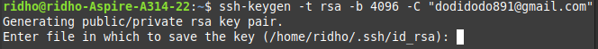
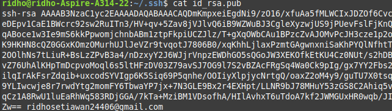
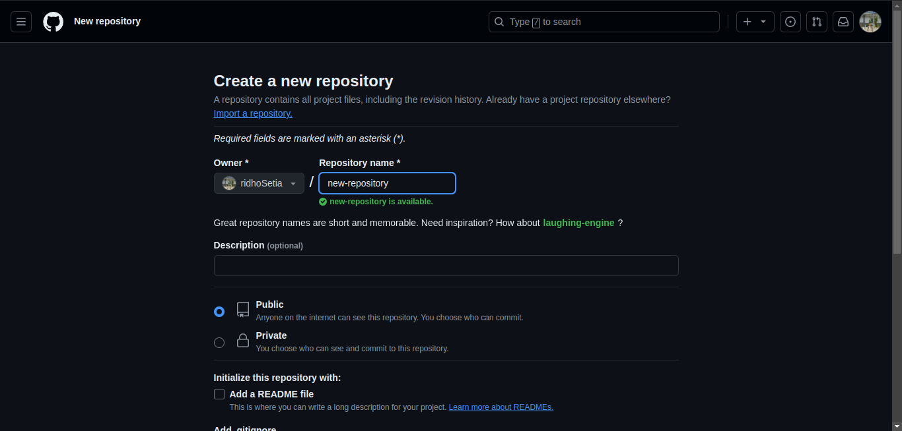

# Cara buat repository github menggunakan git remote di linux mint, ubuntu, debian

## 1. Install git
```
sudo apt install git
```

## 2. Buatlah SSH Key Pair baru
```
ssh-keygen -t rsa -b 4096 -C "your_email"
```
<br>
Klik `enter`

<br>
Masukkan `kata sandi` (opsional)

Ini akan menghasilkan dua berkas baru dan berada di dalam folder .ssh:

- id_rsa: Kunci privat Anda (jaga agar tetap aman! Jangan pernah membagikan berkas ini dengan siapa pun)
- id_rsa.pub: Kunci publik Anda (Anda harus menyalinnya)

## 3. Tambahkan Public Key baru ke Github
### 1. Buka konten file id_rsa.pub
Pastikan ada folder `.ssh`
```
ls -a
```

Arahkan terminal ke folder `.ssh`

```
cd .ssh
```

Buka konten dari file `id_rsa.pub`

```
cat id_rsa.pub
```

<br>
Salin teks tersebut
###  2. Buka pengaturan GitHub Anda dan arahkan ke bagian "Kunci SSH dan GPG".
###  3. Klik "Kunci SSH baru" dan tempelkan konten file id_rsa.pub Anda ke dalam bidang kunci.
###  4. Berikan judul deskriptif pada kunci Anda (misalnya, "New Private Key").
###  5. Klik "Tambahkan kunci SSH".

## 4. Buat repository Github

Ikuti langkah dibawah ini:

1.Pindahkan terminal ke folder yang ingin digunakan untuk repository Github
```
cd namaFolderRepository
```

2.Buat file README
```
echo "# repositoryName" >> README.md
```

3.Inisialisasi repository baru
```
git init
```

4.Tambahkan semua file yang ada di dalam folder repository
```
git add .
```

5.Simpan perubahan
```
git commit -m "commit message"
```

6.Ubah branch menjadi main
```
git branch -M main
```

7.Menambah remote repository
```
git remote add origin git@github.com:usernameGithub/repositoryName.git
```

Selamat anda sudah berhasil membuat repository Github dengan menggunakan git remote 🥳.

Lakukan ini jika ingin melakukan commit dan push:
```
git add .
```

```
git commit -m "commit message"
```

```
git push
```
